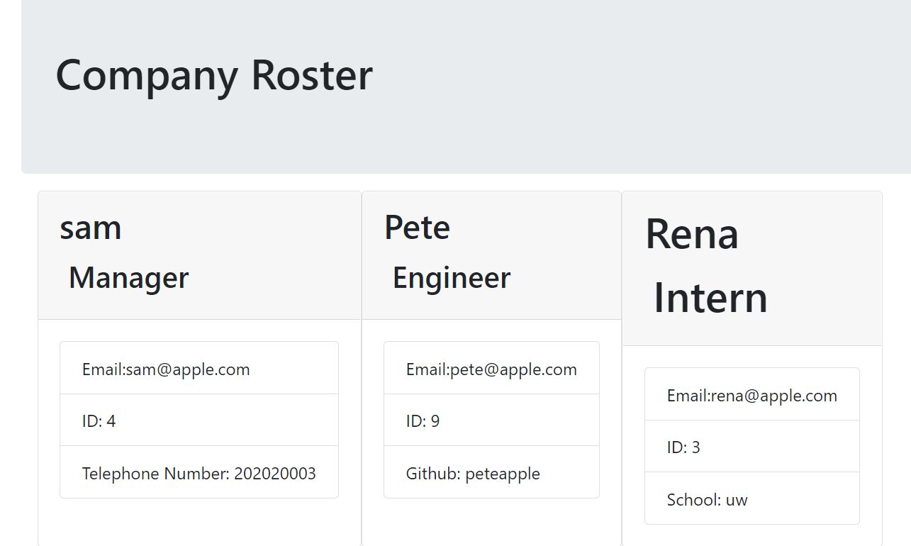

# team-profilegenerator

## HW 10 - Profile generator

## Task

To create a Profile generator!
For this project I am creating a profile generator so that when a user is prompted with questions they can select those criteria for the employees to generate a company roster.

## Javascript

The following was executed in the Javascript:

- The user is able to use a command line to create a company roster.
- User is prompted to select their team members and provide their information github user, email, id, and name
- An HTML is generated so that it displays information that the user inputs

## Links

[Github](https://github.com/rileyale001/team-profilegenerator)

[Website video](https://www.youtube.com/watch?v=IJO0xBGoO4o)
